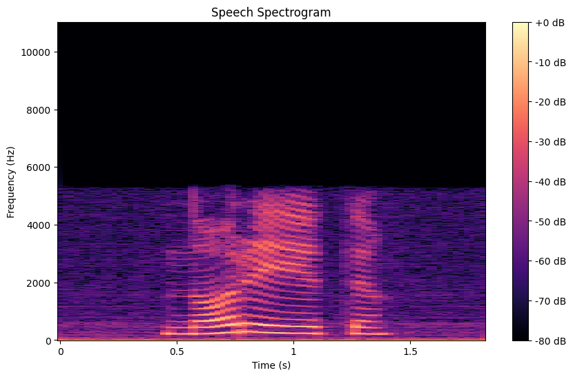
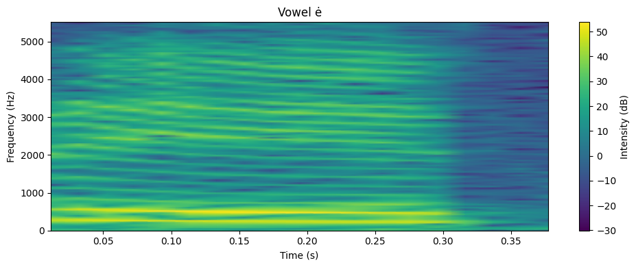
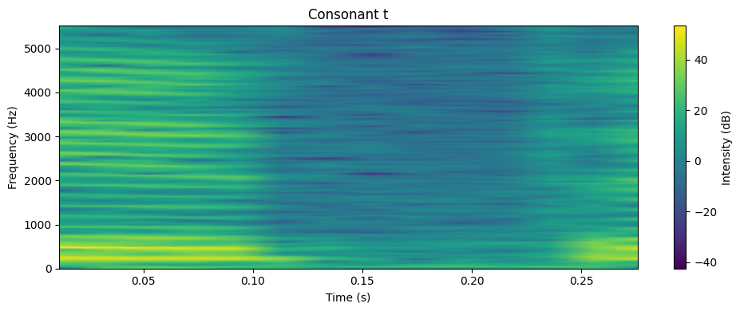

# Kalbos signalų spektrinė analizė

[Sąvokų sąrašas](#kalbos-signalų-spektrinės-analizės-sąvokos)

## Dažninio turinio analizė per spektogramas

Pagrindinės stebimos ypatybės:

- Matomos aiškios horizontalios linijos (formantai), ypač pradžioje ir viduryje įrašo – tai rodo balsių buvimą.
- Yra taip pat triukšmingesni segmentai, kuriuose nėra ryškių formantų – tai greičiausiai priebalsiai.

Dažniai:

- Žemų dažnių ruožai (apie 300–1000 Hz) – pirmas formantas (F1).
- Vidutinių dažnių ruožai (apie 1500–2500 Hz) – antras formantas (F2).
- Aukštesni dažniai – dažniausiai triukšmas ar priebalsių komponentai.

## Spektrinių ypatybių palyginimas tarp „ė“ (balsio) ir „t“ (priebalsio)

### Balsis „ė“
- Aiškiai matomi horizontalūs ruožai — tai formantai (F1, F2, F3).
- **Pirmasis formantas (F1)** — maždaug ties **400–600 Hz**.
- **Antrasis formantas (F2)** — apie **1800–2200 Hz**.
- Dažnių energija yra **stabili**, ilgesnio laiko tarpo, garsas **periodiškas**.

#### Tai rodo, kad balsis „ė“ yra:
- Išgaunamas su **aukštesne liežuvio padėtimi** (vidutinis F1).
- Liežuvio padėtis yra **priekinėje burnos dalyje** (aukštas F2).

### Priebalsis „t“
- Spektrogramoje **nėra aiškių formantų**.
- Yra trumpa **sprogstamoji dalis** (staigus energijos pliūpsnis) aplink **3000–4000 Hz**.
- Garso trukmė labai **trumpa** — būdinga **okliuziniams priebalsiams** ([t] garsui).
- Nėra aiškios **periodiškos struktūros** — tik **trumpas triukšmingas sprogimas**.

### Apibendrinanti lentelė

| Savybė              | Balsis „ė“                    | Priebalsis „t“               |
|:---------------------|:------------------------------|:------------------------------|
| Spektrinė struktūra   | Aiškūs formantai (F1, F2, F3)  | Staigus, trumpas triukšmas     |
| Periodiškumas         | Yra (balso stygų vibracija)    | Nėra (neperiodiškas sprogimas) |
| Dominuojantys dažniai | 400–2200 Hz                   | 3000–4000 Hz                  |
| Garso trukmė          | Ilgesnė, stabilus rezonansas   | Labai trumpa, sproginė         |
| Garso šaltinis        | Balso stygos + rezonansas burnoje | Oro srauto užspaudimas ir išsiveržimas |

### Kodėl taip yra?

- **Balsiai**: garsą generuoja **balso stygų virpėjimas** + **rezonansas burnos ertmėje** (susidaro formantai). **Balsiai** turi aiškias ir nuspėjamas **rezonansines struktūras** (formantus).   
- **Priebalsiai**: garsas atsiranda iš **sutrūkusio oro srauto** (pvz., [t] užspaudžiant liežuvį prie dantų ir greitai atleidžiant). **Priebalsiai** (ypač sprogstamieji kaip [t]) **neturi aiškių rezonansų** — jie sudaryti iš labai greitų triukšmingų pokyčių.   

## Formantai ir artikuliacija

**Formantai** – tai rezonansiniai dažniai, atsirandantys oro vibracijai skleidžiantis per burnos, ryklės ir nosies ertmes.
Jie priklauso nuo **artikuliacijos** – liežuvio, lūpų ir žandikaulio padėties. Formantų struktūra tiesiogiai atspindi fonemų artikuliaciją: kaip aukštai ar žemai yra liežuvis, ar jis priekyje ar gale, ar lūpos suapvalintos, ir panašiai.

### 1. Kas kontroliuoja formantus?

| Artikuliacijos aspektas | Poveikis formantams |
|--------------------------|----------------------|
| Liežuvio aukštis | Keičia pirmą formantą (F1): aukštas liežuvis → žemas F1; žemas liežuvis → aukštas F1 |
| Liežuvio horizontalioji padėtis | Keičia antrą formantą (F2): priekinis liežuvis → aukštas F2; užpakalinis liežuvis → žemas F2 |
| Lūpų forma | Suapvalintos lūpos sumažina tiek F1, tiek F2 |
| Žandikaulio padėtis | Atidarytas žandikaulis kelia F1 dažnį |

### 2. Pavyzdžiai iš balsių

| Balsis | Artikuliacija | F1 | F2 |
|--------|---------------|----|----|
| [i] („į“) | Aukštas liežuvis, priekyje | Žemas | Labai aukštas |
| [u] („ū“) | Aukštas liežuvis, gale, lūpos apvalios | Žemas | Žemas |
| [a] („a“) | Žemas liežuvis, centras | Aukštas | Vidutinis |
| [ė] („ė“) | Vidutinis liežuvis, priekyje | Vidutinis | Aukštas |

Skirtingi balsiai atpažįstami pagal F1 ir F2 kombinaciją.

### 3. Kodėl priebalsiai neturi aiškių formantų?

- Priebalsių, ypač sprogstamųjų ([p], [t], [k]), garsas atsiranda iš oro srauto sutrikdymo, o ne iš rezonanso.
- Tik sonoriniai priebalsiai (pvz., [m], [n], [l], [r]) gali turėti silpnus formantus.

## Kalbos signalų spektrinės analizės sąvokos

| Sąvoka | Apibrėžimas |
|--------|-------------|
| **Spektrograma** | Grafinis garso signalo dažninio turinio vaizdavimas laiko atžvilgiu, kur spalvos ar intensyvumas rodo energijos pasiskirstymą dažniuose. |
| **Formantai** | Rezonansiniai dažniai, atsirandantys oro vibracijai skleidžiantis per burnos, ryklės ir nosies ertmes. |
| **Artikuliacija** | Liežuvio, lūpų ir žandikaulio padėtis, kuri veikia kalbos garsų produkciją ir formantų struktūrą. |
| **F1 (Pirmasis formantas)** | Žemesnių dažnių juosta (apie 300-1000 Hz), kurią pirmiausia veikia liežuvio aukštis. |
| **F2 (Antrasis formantas)** | Vidutinių dažnių juosta (apie 1500-2500 Hz), kurią pirmiausia veikia horizontali liežuvio padėtis. |
| **F3 (Trečiasis formantas)** | Aukštesnių dažnių formantas, minimas balsių analizėje. |
| **Balsiai** | Kalbos garsai su aiškiomis formantų struktūromis, sukuriami balso stygų vibracija ir burnos ertmės rezonansu. |
| **Priebalsiai** | Kalbos garsai, paprastai be aiškių formantų, sukuriami sutrikdytu oro srautu. |
| **Sprogstamieji/Okliuziniai priebalsiai** | Priebalsiai, tokie kaip "t", pasižymintys trumpu sprogstančiu užblokuoto oro srauto išlaisvinimo garsu. |
| **Periodiškumas** | Reguliarus, pasikartojantis šablonas balsių garsuose, sukeltas balso stygų vibracijos. |
| **Rezonansas** | Tam tikrų dažnių sustiprinimas burnos ertmėje, dėl kurio susidaro formantai. |
| **Sonoriniai priebalsiai** | Priebalsiai, tokie kaip [m], [n], [l], [r], kurie gali turėti silpnus formantus. |
| **Liežuvio aukštis** | Vertikali liežuvio padėtis, kuri pirmiausia veikia F1. |
| **Liežuvio horizontalioji padėtis** | Priekinė-užpakalinė liežuvio pozicija, kuri pirmiausia veikia F2. |
| **Lūpų forma** | Lūpų konfigūracija, kuri gali sumažinti tiek F1, tiek F2, kai lūpos suapvalintos. |
| **Žandikaulio padėtis** | Žandikaulio atidarymo laipsnis, kuris kelia F1 dažnį, kai labiau atviras. |
